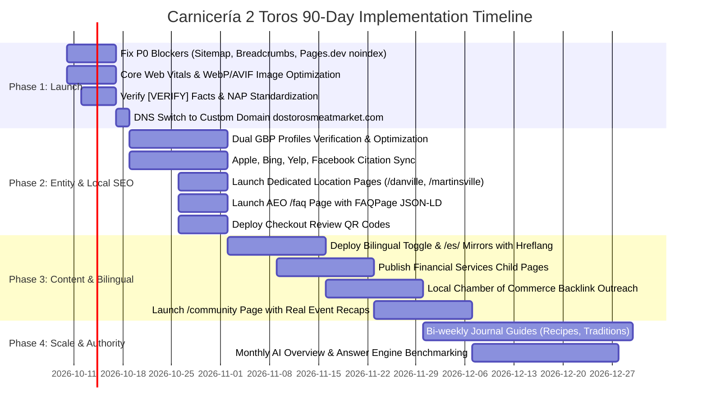

# Carnicería 2 Toros — Unified SEO, GEO, AEO & Copywriting Master Plan

**Target Production Domain:** `dostorosmeatmarket.com`  
**Current Preview URL:** `toros-4op.pages.dev` (Cloudflare Pages)  
**Target Markets:** Danville, VA & Martinsville, VA (Southside Virginia / Piedmont NC border)  
**Primary Strategic Objective:** Promote the **store, culture, and community** (not individual inventory items). Dominate Local Search, Google Business Profile (GBP), Answer Engines (AEO), and Generative AI Search (GEO).

---

## 1. Brand Guidelines & Editorial Standards

### Brand Identity & Naming Conventions
- **Primary Name:** Use **Carnicería 2 Toros Meat Market** on first mention; subsequent mentions use **2 Toros**.
- **Normalization:** Standardize spelling across the site and external directories. Eliminate arbitrary variants (`Carniceria`, `Tienda 2 Toros`).
- **Tone of Voice:** Warm, community-rooted, human, authentic. Avoid unprovable marketing superlatives (*"freshest"*, *"best"*, *"most beloved"*). Substantiate claims with concrete facts (e.g., house-made corn tortillas, weekend barbacoa tradition, in-store community financial services).
- **Two-Location Clarity:** Never blur locations. Every contact point, service, menu, and hour set must explicitly indicate whether it applies to **Danville**, **Martinsville**, or **Both**. Avoid artificial city-swapped doorway copy.

### Verification Matrix (`[VERIFY]` Before Production Launch)
- [ ] **Founding & History:** Confirm Maria Luna founding date (2015), exact backstory, and opening date of Martinsville vs. Danville.
- [ ] **Danville Address & Suite:** Verify exact USPS/GBP format: `215 Westover Dr, Suites A & B, Danville, VA 24541`.
- [ ] **Phone Number Routing:** Confirm primary voice call vs. text/WhatsApp lines per store:
  - Call: `434-709-6189` | Text/WhatsApp: `434-304-8439` (Clarify if shared or store-specific).
- [ ] **Store Hours:** Confirm 9:00 AM – 9:00 PM daily for both stores, including holiday schedules.
- [ ] **Service Availability:** Confirm which services operate at each store: Money transfers (Western Union, Vigo, Maxi), Check cashing, Utility bill pay, Phone top-ups, Copies/lamination.
- [ ] **Weekend Food Prep:** Confirm if barbacoa & carnitas are prepared at Danville only or both locations, and whether sold by pound or portion.
- [ ] **Active Promotions:** Audit Grand Opening offers, reusable bag giveaway, and $80 deal; retire expired promotions.
- [ ] **Legal/Permissions:** Obtain written consent for named staff, family members, and customer event photography.

---

## 2. Technical SEO & Launch Blockers

| Priority | Issue | Required Resolution |
| :--- | :--- | :--- |
| **P0 Blocker** | Broken Sitemap | `robots.txt` points to dead external URL `toros.foxastron2.workers.dev/sitemap-index.xml`. Generate native `sitemap.xml` on `dostorosmeatmarket.com`. Submit to Google Search Console & Bing Webmaster Tools. |
| **P0 Blocker** | Duplicate Content / Preview Leak | Prevent `toros-4op.pages.dev` from indexing. Apply Cloudflare Transform Rule/Worker or `_headers` to inject `X-Robots-Tag: noindex` on the `.pages.dev` host. Set self-referential canonicals pointing exclusively to `https://dostorosmeatmarket.com`. |
| **P0 Blocker** | Breadcrumb Routing Bug | `/contact` and `/services` render `"Home > Not found"`. Fix breadcrumb route resolver and validate `BreadcrumbList` JSON-LD schema. |
| **P0 Blocker** | Marketing Placeholders | Remove placeholder strings like *"Links to be provided by marketing team"*. Link to real active social profiles (Facebook, Instagram, WhatsApp) or omit. |
| **P0 Blocker** | Indexation Controls | Enforce `noindex` across staging/preview. Remove `noindex` only upon custom domain DNS propagation. |
| **P1 Technical** | Core Web Vitals & Media | Convert hero collage and all photography to **AVIF/WebP** with explicit `width`/`height` attributes to prevent CLS. Preload only LCP hero; lazy-load all below-fold assets. Targets: LCP < 2.5s, CLS < 0.1, INP < 200ms. |
| **P1 Technical** | Headings & Hierarchy | Enforce single semantic `<h1>` per page. Homepage hero contains fragmented decorative text; wrap crawler-facing text in one cohesive `<h1>`: *"Carnicería 2 Toros — Mexican Meat Market & Latin Grocery in Danville, VA"*. |
| **P1 Technical** | URL & Host Canonicals | 301-redirect all non-canonical permutations (`http://`, `http://www`, `https://www`) to `https://dostorosmeatmarket.com`. Enforce strict trailing-slash consistency. Implement branded 404 page returning HTTP 404. |
| **P1 Technical** | Catalog Handling (`/products`) | The 5,352 JS-loaded inventory list is a utility browser, not an SEO asset. Add `noindex, follow` to all parameterized/faceted search URLs. Do not create thin programmatic item pages. |

---

## 3. Local SEO, GBP & Citation Architecture

### Google Business Profile (GBP) — Dual Setup
Establish and verify **two distinct GBP profiles**:
1. **Danville Listing:**
   - **Primary Category:** Mexican grocery store
   - **Secondary Categories:** Butcher shop, Grocery store, Money transfer service
   - **Address:** 215 Westover Dr, Suites A & B, Danville, VA 24541
   - **Hours:** Mon–Sun, 9:00 AM – 9:00 PM
2. **Martinsville Listing:**
   - **Primary Category:** Mexican grocery store
   - **Secondary Categories:** Butcher shop, Grocery store
   - **Address:** 6280 A L Philpott Hwy, Martinsville, VA 24112
   - **Hours:** Mon–Sun, 9:00 AM – 9:00 PM

### Ongoing Local SEO Operating Cadence
- **Weekly Photography:** Upload fresh high-res photos every Friday (butcher counter cuts, weekend barbacoa prep, house-made tortillas, seasonal produce).
- **Weekly GBP Posts:** Publish Friday menu update and special community announcements.
- **Pre-seeded Q&A:** Seed and answer top 10 local queries (hours, barbacoa days, accepted payments/SNAP/EBT, money transfers, parking).
- **Review Generation:** Place bilingual QR codes at checkout counters. Maintain a 100% review response rate in the customer's language.

### Core Citations & Backlinks
- Sync exact NAP (Name, Address, Phone) across Apple Business Connect, Bing Places, Yelp, Facebook, YellowPages, Superpages, Foursquare, Angi, and Nextdoor.
- Secure localized high-authority backlinks: Danville-Pittsylvania County Chamber of Commerce, Martinsville-Henry County Chamber of Commerce, and local editorial press (*Danville Register & Bee*, *Martinsville Bulletin*).

---

## 4. AEO & GEO Structured Data Engine

### JSON-LD Entity Architecture (Sitewide)
Deploy linked JSON-LD on every page to enable AI engine entity resolution:
- `@type`: `GroceryStore` / `LocalBusiness`
- `name`: "Carnicería 2 Toros Meat Market"
- `alternateName`: ["2 Toros", "Carnicería 2 Toros"]
- `foundingDate`: "2015"
- `founder`: `{"@type": "Person", "name": "Maria Luna"}`
- `areaServed`: ["Danville", "Martinsville", "Pittsylvania County", "Henry County", "Chatham", "Gretna", "South Boston", "Collinsville", "Bassett", "Stuart", "Eden, NC"]
- `sameAs`: [GBP URLs, Facebook, Instagram, Yelp, Bing Places]
- Dedicated schema types: `BreadcrumbList` (all pages), `FAQPage` (`/faq` and homepage), `Menu` (`/weekend-specials`), `Event` (`/community`), `Recipe` (`/journal/recipes`).

### AEO Direct-Answer Framework
AI Overviews, Bing Copilot, and Perplexity prioritize direct answers. Structure all core informational sections using a **40–60 word self-contained definition sentence** immediately following the H2/H3 question header, followed by elaborating HTML tables or lists.

#### Core Seed Questions & Direct Answer Formats
1. **Q: What time does Carnicería 2 Toros open in Danville and Martinsville, VA?**  
   *A:* Carnicería 2 Toros is open seven days a week from 9:00 AM to 9:00 PM at both Virginia locations: 215 Westover Dr in Danville, VA, and 6280 A L Philpott Hwy in Martinsville, VA. Both stores remain open on Sundays.
2. **Q: Where can I buy fresh barbacoa and carnitas in Danville, VA?**  
   *A:* Carnicería 2 Toros serves freshly prepared traditional beef barbacoa and pork carnitas every Saturday and Sunday starting at 9:00 AM at the Danville market (215 Westover Dr). Meats are sold by the pound with fresh tortillas, salsas, and cilantro.
3. **Q: What money transfer and financial services are offered at Carnicería 2 Toros?**  
   *A:* Carnicería 2 Toros provides bilingual community financial services in Danville, including international money transfers (Western Union, Vigo, Maxi), non-bank payroll check cashing, utility bill payments, and domestic and international prepaid mobile top-ups.
4. **Q: Can I order specialty cuts of meat or party platters ahead of time?**  
   *A:* Yes. Customers can pre-order custom meat cuts, bulk barbecue meats, and catering trays for family gatherings or quinceañeras by calling or messaging the store directly 24 to 48 hours in advance.

---

## 5. Site Architecture & Page-by-Page Specifications

### Target Site Architecture
```text
/                              (Homepage — Community & Store Hub)
/about                         (Our Story — Luna Family, History & Values)
/locations/danville            (Dedicated Danville Store Page — NAP, Map, Services)
/locations/martinsville        (Dedicated Martinsville Store Page — NAP, Map, Services)
/services                      (Services Overview Hub)
  /services/money-transfer     (Western Union, Vigo, Maxi)
  /services/check-cashing      (Payroll & Personal Check Cashing)
  /services/bill-pay           (Utility & Household Bill Payments)
  /services/recargas           (Mobile Phone Top-ups)
/weekend-specials              (HTML Barbacoa & Carnitas Menu + PDF Download)
/order                         (Order Ahead for Pickup Workflow)
/community                     (Community Partnerships, Events & Photo Recaps)
/faq                           (AEO Direct-Answer Knowledge Base)
/journal                       (Culture, Cooking Traditions & Local Guides)
/products                      (Client-side Catalog Browser — noindex parameter facets)
/es/...                        (Spanish language mirrors with hreflang tags)
```

---

### Detailed Page Copy & Metadata

```markdown
<!-- PAGE: HOMEPAGE (/) -->
Title: Carnicería 2 Toros | Danville & Martinsville, VA
Meta Description: Family-owned meat market, Latin grocery, and community hub serving Danville and Martinsville, VA. Store hours, butcher cuts, financial services, and weekend barbacoa.
Canonical: https://dostorosmeatmarket.com/

[HERO]
Eyebrow: Family-owned · Serving Southside Virginia since 2015 [VERIFY]
H1: Your Market. Your Community.
Lead Copy: Carnicería 2 Toros brings together a traditional neighborhood meat market, authentic Latin groceries, house-made foods, and essential daily services. Visit our stores in Danville or Martinsville, Virginia.
CTAs: [Choose a Location] (anchor link) · [Read Our Story](/about)

[LOCATION SELECTOR CARDS]
Card 1: Danville Store
Address: 215 Westover Dr, Suites A & B, Danville, VA 24541 [VERIFY]
Hours: Open Daily, 9:00 AM – 9:00 PM [VERIFY]
Phone: Call 434-709-6189 · Text/WhatsApp 434-304-8439
Actions: [Get Directions] · [Call Store] · [View Danville Details](/locations/danville)

Card 2: Martinsville Store
Address: 6280 A L Philpott Hwy, Martinsville, VA 24112
Hours: Open Daily, 9:00 AM – 9:00 PM [VERIFY]
Phone: Call [Martinsville Phone] [VERIFY]
Actions: [Get Directions] · [Call Store] · [View Martinsville Details](/locations/martinsville)

[SECTION: STORY TEASER]
H2: Rooted in Southside Virginia Since 2015
Body: Carnicería 2 Toros began with the Luna family's vision to bring traditional flavors, custom butcher cuts, and a welcoming community market to Danville. Today, both locations provide fresh meats, imported Latin specialty goods, kitchen staples, and everyday financial services under one roof.
Link: [Meet the Family & Read Our Full Story](/about)

[SECTION: BUTCHER COUNTER & PANTRY]
H2: A Traditional Meat Market with More to Offer
Body: Our butcher counter prepares specialty cuts daily for authentic family meals, carne asada cookouts, and community gatherings. Explore fresh produce, house-made tortillas, Mexican cheeses, dried chilies, and imported pantry staples.
Note: Selection and specialty items may vary by store; contact your local location to check daily counter cuts.

[SECTION: WEEKEND TRADITION]
H2: Saturday & Sunday Kitchen Traditions
Body: Every Saturday and Sunday morning, our kitchen prepares traditional slow-cooked beef barbacoa, crispy carnitas, chicharrón, and house salsas in Danville [VERIFY if Danville-only]. Items are prepared fresh and sold by the pound until sold out.
CTA: [View Weekend Menu & Serving Details](/weekend-specials)

[SECTION: COMMUNITY SERVICES]
H2: Everyday Financial & Neighborhood Services
Body: Beyond groceries, 2 Toros serves as a vital community resource. Send remittances home, cash payroll checks, pay utility bills, top up domestic or international phone plans, or make copies.
CTA: [Explore In-Store Services](/services)
```

---

```markdown
<!-- PAGE: ABOUT (/about) -->
Title: Our Story | Carnicería 2 Toros Meat Market
Meta Description: Learn how the Luna family founded Carnicería 2 Toros in Danville, VA, creating a traditional meat market, Latin grocery, and community gathering space.
Canonical: https://dostorosmeatmarket.com/about

H1: Our Story
H2: A Family Market Built on Heritage and Community
Body: Carnicería 2 Toros began in Danville in 2015 when Maria Luna established a neighborhood grocery to bring the authentic flavors and comforts of Mexico to the local community [VERIFY]. What started as a focused family dream grew into two vibrant markets serving Danville, Martinsville, and surrounding counties.

The name "2 Toros" ("two bulls") represents strength, diligence, and working together side-by-side. For our family, that means combining authentic culinary traditions with dedicated customer care.

Whether you are picking up marinated fajitas for dinner, gathering for weekend barbacoa, or sending money to family abroad, we welcome you with open arms. We are deeply grateful to our neighbors in Southside Virginia for welcoming us into their daily lives.

H2: What Drives Us
1. Pride in the Counter: We take time to cut, trim, and prepare meats to order, stocking high-quality staples that home cooks depend on.
2. Traditions Worth Preserving: Food connects generations. From weekend slow-cooked meats to fresh tortillas, our kitchen keeps traditional recipes alive.
3. Standing with Our Community: A true neighborhood carnicería supports its community. We provide transparent daily financial services and support local families year-round.

CTAs: [Visit Danville Store](/locations/danville) · [Visit Martinsville Store](/locations/martinsville) · [View Community Work](/community)
```

---

```markdown
<!-- PAGE: DEDICATED LOCATION PAGES (/locations/danville & /locations/martinsville) -->
<!-- Danville Page -->
Title: Carnicería 2 Toros Danville | Meat Market & Latin Grocery
Meta Description: Visit Carnicería 2 Toros at 215 Westover Dr, Danville, VA. Fresh butcher meats, Latin grocery staples, money transfers, bill pay, and weekend barbacoa.
Canonical: https://dostorosmeatmarket.com/locations/danville

H1: Carnicería 2 Toros — Danville, Virginia
Intro: Serving Danville, Pittsylvania County, Chatham, Gretna, and South Boston with authentic butcher cuts, Latin groceries, and bilingual financial services.
Address: 215 Westover Dr, Suites A & B, Danville, VA 24541 [VERIFY]
Hours: Monday–Sunday, 9:00 AM – 9:00 PM
Phone: Call 434-709-6189 · Text/WhatsApp 434-304-8439
Store Features:
- Full Service Butcher Counter (bistec, cecina, pastor, chorizo, costillas)
- Saturday & Sunday Hot Barbacoa & Carnitas
- Financial Services: Western Union/Vigo money transfers, check cashing, bill pay
- Spanish/English bilingual customer assistance
CTAs: [Open in Google Maps] · [Call Store] · [Pre-Order for Pickup](/order)

<!-- Martinsville Page -->
Title: Carnicería 2 Toros Martinsville | Meat Market & Latin Grocery
Meta Description: Visit Carnicería 2 Toros at 6280 A L Philpott Hwy, Martinsville, VA. Fresh custom butcher cuts, Latin groceries, tortillas, and essential services.
Canonical: https://dostorosmeatmarket.com/locations/martinsville

H1: Carnicería 2 Toros — Martinsville, Virginia
Intro: Serving Henry County, Collinsville, Bassett, Stuart, and Eden, NC, with fresh custom meat cuts, fresh produce, and Latin pantry essentials.
Address: 6280 A L Philpott Hwy, Martinsville, VA 24112
Hours: Monday–Sunday, 9:00 AM – 9:00 PM
Phone: [Martinsville Phone Number] [VERIFY]
Store Features:
- Custom butcher counter cut to order
- Fresh produce, tortillas, cheeses, and spices
- In-store services [VERIFY exact services available at Martinsville]
CTAs: [Open in Google Maps] · [Call Store] · [Pre-Order for Pickup](/order)
```

---

```markdown
<!-- PAGE: SERVICES (/services) -->
Title: In-Store Financial & Daily Services | Carnicería 2 Toros VA
Meta Description: Fast, reliable money transfers (Western Union, Vigo, Maxi), check cashing, utility bill payments, and phone top-ups at Carnicería 2 Toros in Virginia.
Canonical: https://dostorosmeatmarket.com/services

H1: Reliable Daily Services, Close to Home
Body: Carnicería 2 Toros serves as a trusted community service center. We offer convenient, bilingual financial and communication services seven days a week.

[SERVICE BLOCKS]
1. International Money Transfers
   Send money safely to family across Mexico, Central America, South America, and worldwide. We partner with established global providers including Western Union, Vigo, and Maxi [VERIFY]. Bring a valid government-issued photo ID.
2. Payroll & Check Cashing
   Cash your payroll and government checks quickly without needing a traditional bank account [VERIFY requirements and fee schedule].
3. Utility Bill Payments
   Pay household electric, gas, water, internet, and municipal utility bills in person with cash or debit.
4. Domestic & International Phone Top-Ups (Recargas)
   Add minutes and mobile data to major US carriers and prepaid international mobile networks instantly.
5. Document Services
   Fast black-and-white or full-color copies, document printing, and identification lamination available on site.

Location Availability Notice: Services and provider systems vary by store location. Call your nearest store to verify required identification documents and current fees.
CTAs: [Contact Danville Services] · [Contact Martinsville Services]
```

---

```markdown
<!-- PAGE: WEEKEND SPECIALS (/weekend-specials) -->
Title: Weekend Barbacoa & Carnitas | Carnicería 2 Toros Danville
Meta Description: Authentic weekend barbacoa de res and carnitas michoacanas every Saturday & Sunday at Carnicería 2 Toros in Danville, VA. Sold by the pound.
Canonical: https://dostorosmeatmarket.com/weekend-specials

H1: Weekend Kitchen Specialties: Barbacoa & Carnitas
Body: Every Saturday and Sunday morning starting at 9:00 AM, our Danville store prepares authentic, slow-cooked meats following traditional regional Mexican recipes. Available hot by the pound for takeout.

[HTML MENU TABLE]
| Item | Preparation & Details | Serving Unit | Availability |
| :--- | :--- | :--- | :--- |
| **Barbacoa de Res** | Slow-braised beef, tender and spiced with traditional chilies and aromatics | By the pound / Half-pound | Sat & Sun (Until sold out) |
| **Carnitas Michoacanas** | Copper-kettle confit pork (costilla, maciza, cuerito, buche) | By the pound / Half-pound | Sat & Sun (Until sold out) |
| **Chicharrón Crujiente** | Freshly fried pork rinds with meat attached | By the piece / weight | Sat & Sun |
| **Consomé de Barbacoa** | Rich seasoned beef broth with garbanzos and rice | 16 oz / 32 oz container | Sat & Sun |

[ACCOMPANIMENTS & FIXINGS]
Complete your weekend feast with kitchen extras:
- Warm corn tortillas made fresh
- House-made salsa verde, salsa roja, and habanero pickle
- Fresh limes, chopped cilantro, diced white onion
- Authentic guacamole and fresh queso fresco

Note: Weekend items sell out quickly. Call ahead early Sunday morning to reserve pounds for pickup.
PDF Menu: [Download Printable Menu (PDF)]
CTAs: [Call Danville to Check Availability: 434-709-6189] · [Get Directions to Danville]
```

---

```markdown
<!-- PAGE: ORDER (/order) -->
Title: Order Counter Cuts & Weekend Meals | Carnicería 2 Toros
Meta Description: Call or message Carnicería 2 Toros to place advance meat orders, weekend barbacoa reservations, or large gathering catering orders in Virginia.
Canonical: https://dostorosmeatmarket.com/order

H1: Order Ahead for Fast In-Store Pickup
Body: We prepare custom butcher cuts and party orders in advance to save you time. Choose your store location, place your order via phone or WhatsApp/text, and we will have it wrapped and ready for counter pickup.

[HOW TO ORDER]
1. Select Your Store: Choose either our Danville or Martinsville counter.
2. Message or Call: Tell us your desired meat cuts (pounds, thickness, seasoning/marinade) or weekend food quantities, and your desired pickup time.
3. Confirmation: Our butcher team will confirm availability, total price, and pickup timing.

[LARGE ORDERS & CELEBRATIONS]
Planning a family reunion, quinceañera, cookout, or company lunch? We prepare bulk marinated meats (carne asada, pollo marinado, pastor) and catering sides. Please contact us 24–48 hours in advance for large gathering orders [VERIFY notice window].

CTAs:
[Call Danville: 434-709-6189] · [WhatsApp / Text Danville: 434-304-8439]
[Call Martinsville: Store Phone] [VERIFY]
```

---

```markdown
<!-- PAGE: PROMOTIONS (/promotions) & COMMUNITY (/community) -->
<!-- Promotions Page Guidelines -->
Title: Current Offers & Store News | Carnicería 2 Toros
Meta Description: Active specials, seasonal sales, and community promotions at Carnicería 2 Toros in Danville and Martinsville, VA.
Canonical: https://dostorosmeatmarket.com/promotions

Editorial Rule: Never publish expired "Grand Opening" or "first 100 customer" announcements. If no active seasonal offer is running, redirect `/promotions` to `/community` or display ongoing in-store values (e.g., everyday butcher meat bundles).

Structured Promo Template (When active):
H2: [Offer Title: e.g., Weekend Carne Asada Family Pack]
- Details: [Exact description of bundle and contents]
- Participating Locations: [Danville / Martinsville / Both]
- Valid Dates: [Specific Start Date] through [Specific End Date]
- Terms: While supplies last. In-store counter pickup only.

<!-- Community Page Guidelines -->
Title: Community & Cultural Gatherings | Carnicería 2 Toros
Meta Description: Community partnerships, cultural celebrations, raffles, and family events hosted by Carnicería 2 Toros across Southside Virginia.
Canonical: https://dostorosmeatmarket.com/community

H1: Deeply Connected to Southside Virginia
Body: A true neighborhood market belongs to the community it feeds. We celebrate our shared heritage, sponsor local initiatives, and host family events throughout the year.

Content Cadence:
- Annual Mother's Day Raffle (Día de las Madres) recaps and winners
- Back-to-school drives and youth sports sponsorships
- Mexican Independence Day (16 de Septiembre) celebrations
- Día de los Muertos community altar displays
- Holiday posadas and tamale season traditions
Include dates, verified partner names, and authorized photography for all events.
```

---

```markdown
<!-- PAGE: PRODUCTS / MARKET BROWSER (/products) -->
Title: Inside the Market Departments | Carnicería 2 Toros
Meta Description: Browse the counter cuts, produce, cheeses, and pantry items available at Carnicería 2 Toros in Danville and Martinsville, VA.
Canonical: https://dostorosmeatmarket.com/products

H1: A Taste of Home, Close to Home
Body: Explore the products, custom cuts, produce, beverages, and traditional pantry essentials available at 2 Toros. Our digital catalog is a browsing utility to help you plan your visit. Inventory, brands, and market prices fluctuate daily. Contact your local store to verify real-time shelf availability.

[DEPARTMENT TILES]
- Butcher Counter & Fresh Meats (Carne de res, puerco, pollo, chorizo casero)
- Traditional Latin Dairy (Queso fresco, cotija, oaxaca, crema mexicana)
- Fresh Produce & Herbs (Chiles, tomatillos, cilantro, nopales, aguacates)
- Bakery & Tortillería (Tortillas de maíz y harina, pan dulce)
- Spices, Dried Chiles & Pantry (Chiles secos, moles, salsas, frijoles)
- Household, Sodas & Refreshments (Mexican Coke, Jarritos, aguas frescas)

Technical Implementation Note: Apply `noindex, follow` to all client-side filter and search parameter states to preserve search engine crawl budget.
```

---

## 6. Bilingual Strategy & Cultural Calendar

### Bilingual Architecture
Southside Virginia's Latin market is primarily Spanish-first. Deploy a comprehensive bilingual infrastructure:
- Provide an intuitive language switcher on all pages (`English` | `Español`).
- Establish dedicated Spanish URLs (e.g., `/es/`, `/es/about`, `/es/locations/danville`, `/es/weekend-specials`).
- Enforce valid bidirectional `hreflang` tags on all pages:
  - `<link rel="alternate" hreflang="en" href="https://dostorosmeatmarket.com/about" />`
  - `<link rel="alternate" hreflang="es" href="https://dostorosmeatmarket.com/es/about" />`
  - `<link rel="alternate" hreflang="x-default" href="https://dostorosmeatmarket.com/about" />`
- Use Spanish page titles optimized for conversational and voice queries:
  - Homepage: `Carnicería 2 Toros | Carnicería Mexicana y Tienda Latina en Danville y Martinsville, VA`
  - Locations: `Carnicería Mexicana en Danville, VA | Carnicería 2 Toros`
  - Weekend Specials: `Barbacoa de Res y Carnitas los Fines de Semana | Carnicería 2 Toros`

### Annual Cultural Content Calendar
| Timeframe | Cultural Focus | Content, Social & Event Deliverables |
| :--- | :--- | :--- |
| **Nov – Jan** | Día de Muertos, Posadas & Holiday Tamales | Tamale prep guides, pre-order tamale meat campaigns, holiday baking supplies, Mexican hot chocolate & ponche ingredients. |
| **Jan – Feb** | Día de la Candelaria (Feb 2) | Tamale orders, traditional atole recipes, and community church notices. |
| **Mar – May** | Día de las Madres & Cinco de Mayo | Annual Mother's Day Customer Raffle, family cookout meat bundles, fajita marinades. |
| **Jun – Aug** | Summer Cookout & Carne Asada Season | Carne asada grilling guides, Father's Day counter cuts, house salsa and ceviche specials. |
| **Sep – Oct** | Fiestas Patrias (Sept 16) | Mexican Independence specials, pozole cuts and hominy displays, festive in-store displays. |
| **Weekly** | Friday Weekend Food Teaser | Multi-channel broadcast (GBP Post, Facebook, Instagram) of Saturday/Sunday barbacoa & carnitas schedule. |

---

## 7. 90-Day Execution Roadmap & KPIs

### Phased Roadmap



- **Phase 1: Launch Blockers & Technical Fixes (Week 0 – 1)**
  - Generate valid `sitemap.xml` on production domain; update `robots.txt`.
  - Block indexation of `toros-4op.pages.dev` with `X-Robots-Tag: noindex`.
  - Resolve breadcrumb routing errors (`"Home > Not found"`).
  - Eliminate placeholder strings; update social links.
  - Compress images to AVIF/WebP; resolve CLS issues; preload LCP.
  - Confirm all `[VERIFY]` matrix items with business ownership.
  - Transition DNS to `dostorosmeatmarket.com` and remove staging `noindex`.
- **Phase 2: Entity Establishment & Local Pack (Weeks 2 – 3)**
  - Fully optimize and verify both GBPs (categories, hours, bilingual attributes, photos, Q&A).
  - Sync Apple Business Connect, Bing Places, Yelp, and Facebook NAP.
  - Publish dedicated store pages (`/locations/danville` & `/locations/martinsville`).
  - Deploy sitewide JSON-LD (`LocalBusiness`, `BreadcrumbList`, `FAQPage`).
  - Print counter QR codes linking directly to Google review submission.
- **Phase 3: Content Expansion & Bilingual Rollout (Weeks 4 – 6)**
  - Roll out bilingual pages (`/es/`) with proper `hreflang` validation.
  - Publish dedicated financial services sub-pages (`/services/money-transfer`, etc.).
  - Join Danville-Pittsylvania and Martinsville-Henry Chambers of Commerce for local backlinks.
  - Publish `/community` with authentic event photography.
- **Phase 4: Content Engine & AI Search Dominance (Weeks 7 – 12)**
  - Maintain 2 posts/week on `/journal` (cooking recipes with `Recipe` schema, party guides).
  - Publish weekly Friday GBP Posts announcing weekend specials.
  - Maintain a review acquisition velocity of 8–10 reviews/month across both stores.
  - Perform monthly prompt testing across ChatGPT, Perplexity, Gemini, and Google AI Overviews to monitor brand citation share.

### Key Performance Indicators (KPIs)
1. **Local Pack Rankings:** Rank in top 3 for *"carnicería near me"*, *"meat market Danville VA"*, *"Mexican grocery Martinsville VA"*, and *"barbacoa Danville VA"*.
2. **Google Business Profile Engagement:** +40% increase in phone calls, direction requests, and website clicks; maintain rating >= 4.8 stars with steady review growth.
3. **AI Search Retrieval:** Verified citation of Carnicería 2 Toros in Google AI Overviews, Perplexity, and ChatGPT for local queries (*"where to buy barbacoa in Southside VA"*, *"best Mexican butcher near Danville"*).
4. **Organic Search Traffic:** Sustained growth in non-branded impressions across location, services, and cultural guide pages.
5. **Direct Customer Conversion:** Measured phone calls and WhatsApp inquiries for meat pre-orders and catering platters.
